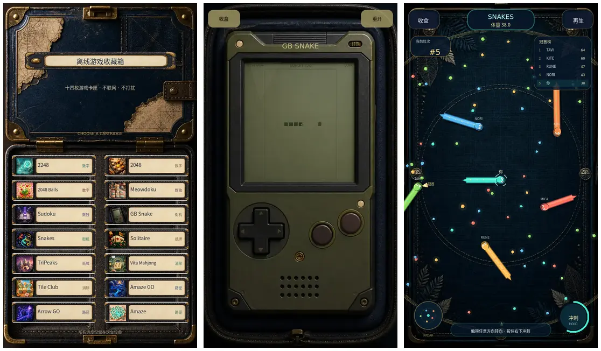

# Offline Games · Godot Edition

A portrait, offline-first collection of fourteen small games built with
Godot 4.6. The collection opens as a tactile travel case with illustrated
cartridges and keeps every game playable without network access.



## Play

- [Play the production Web build](https://offline-games-godot.vercel.app/)
- [Browse the source on GitHub](https://github.com/WitMani/offline-games-godot)
- [Play through Tailscale](https://desktop-youyuan-wsl.tail17a64.ts.net:9443/)
  (members of the configured tailnet only)

## Two different Snake games

- **GB Snake** is a dedicated monochrome handheld game: one food, non-wrapping
  15×23 grid movement, physical D-pad controls, +1 growth, self/wall collision,
  and a real length-120 clear condition.
- **Snakes** is a continuous local arena game: free-angle steering, five local
  bots, glowing seed food, mass-consuming boost, body/boundary collision,
  debris drops, leaderboard, radar, camera follow, death and respawn.

Both are separate rulesets and renderers. GB Snake is not a skin on the arena,
and Snakes is not a wrapping grid variant.

The arena behavior is a clean-room implementation informed by the separate
`136_SNAKES` product shape in JindoBlu Offline Games. No original APK art,
audio, code, banner, dump, or extracted resource is shipped in this project.
Runtime art is original, AI-assisted work created for this edition; all live
text, controls, characters, rankings, particles and feedback are rendered by
Godot.

## Run locally

```bash
godot --path .
```

## Verify

```bash
godot --headless --path . --script res://tools/snake_gb_model_smoke.gd
godot --headless --path . --script res://tools/snakes_arena_model_smoke.gd
godot --headless --path . --script res://tools/snake_input_smoke.gd
godot --headless --path . --script res://tools/snake_modes_integration_smoke.gd
godot --headless --path . --script res://tools/smoke.gd
```

## Export Web

```bash
godot --headless --path . --export-release "Web Evaluator" build/web/index.html
```

The Web preset disables threads and exports a self-contained static site. It
still requires a secure HTTPS context in browsers. `vercel.json` points Vercel
at `build/web` and supplies isolation/security headers.
